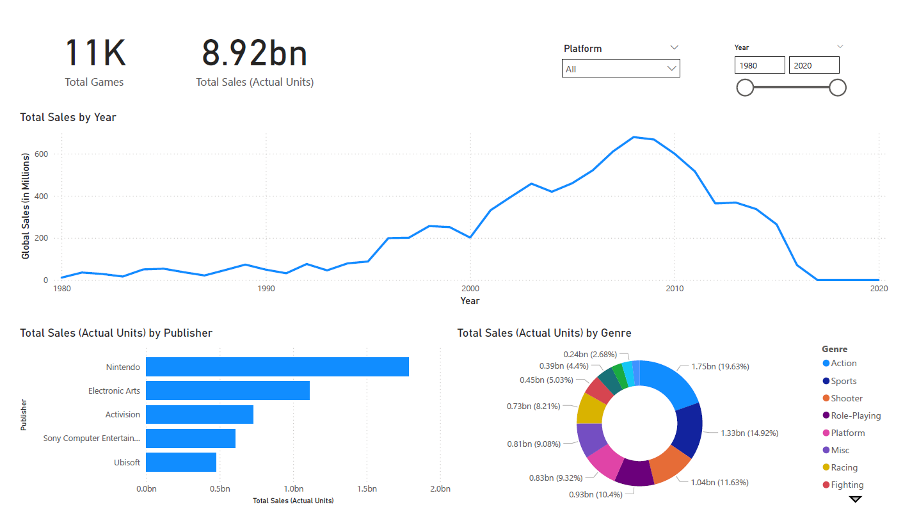
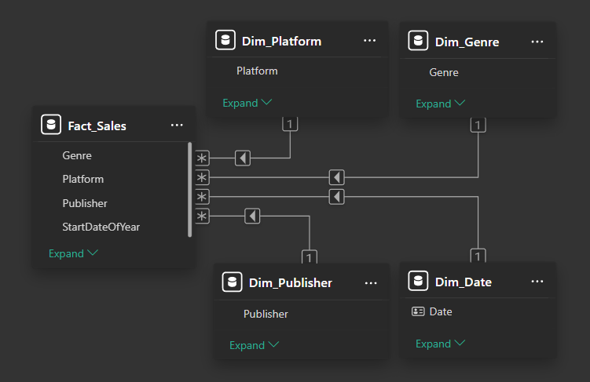

# Phân Tích Doanh Số Ngành Game Toàn Cầu với Power BI

## Dự án End-to-End: Từ dữ liệu thô đến Dashboard tương tác

## Giới Thiệu

Đây là dự án cá nhân nhằm mục đích thực hành và thể hiện các kỹ năng phân tích dữ liệu toàn diện bằng Power BI. Dự án bao gồm tất cả các bước trong một quy trình Business Intelligence (BI) tiêu chuẩn: từ việc làm sạch và tiền xử lý dữ liệu (ETL), xây dựng mô hình dữ liệu quan hệ (Data Modeling), tạo các chỉ số tính toán (DAX Measures), đến việc thiết kế một dashboard tương tác để tìm kiếm insight.

### Dashboard Hoàn Thiện

### Các Câu Hỏi Kinh Doanh Chính

Dashboard được thiết kế để trả lời các câu hỏi sau:

1. Xu hướng doanh số toàn cầu của ngành game thay đổi như thế nào qua các năm?
2. Những nhà phát hành (Publisher) nào đang thống trị thị trường?
3. Thể loại (Genre) và nền tảng (Platform) nào mang lại doanh thu cao nhất?
4. Thị trường game có sự thay đổi ra sao qua các giai đoạn?

---

## Quy Trình Thực Hiện

Dự án được thực hiện theo 4 bước chính, mô phỏng một quy trình BI chuyên nghiệp:

1. **Tiền xử lý & Làm sạch dữ liệu (ETL):** Sử dụng Power Query Editor để làm sạch, chuyển đổi và định hình dữ liệu từ file CSV thô.
2. **Xây dựng Mô hình Dữ liệu (Data Modeling):** Thiết kế một mô hình dữ liệu quan hệ theo kiến trúc **Star Schema** để tối ưu hóa hiệu năng và logic phân tích.
3. **Tạo các Chỉ số Phân tích (DAX Measures):** Viết các công thức DAX để tạo ra các KPI (Key Performance Indicators) quan trọng.
4. **Trực quan hóa & Phân tích (Visualization):** Thiết kế dashboard, tạo các biểu đồ tương tác và rút ra các insight giá trị từ dữ liệu.

---

## 1. Mô Tả Dữ Liệu

- **Nguồn:** [Video Game Sales on Kaggle](https://www.kaggle.com/datasets/gregorut/videogamesales), được tạo bởi Gregory Smith, thu thập từ vgchartz.com.
- **Mô tả:** Dữ liệu chứa thông tin về các trò chơi điện tử có doanh số trên 100 000 bản.

### 1.1 Quy mô & Cấu trúc

- **Số lượng hàng:** 16,598
- **Số lượng cột:** 11

| Tên cột | Diễn giải | Kiểu dữ liệu gốc |
| :--- | :--- | :--- |
| `Rank` | Xếp hạng doanh số toàn cầu | Whole Number |
| `Name` | Tên trò chơi | Text |
| `Platform` | Nền tảng phát hành | Text |
| `Year` | Năm phát hành | Text |
| `Genre` | Thể loại game | Text |
| `Publisher` | Nhà phát hành | Text |
| `NA_Sales` | Doanh số tại Bắc Mỹ (triệu bản) | Decimal Number |
| `EU_Sales` | Doanh số tại Châu Âu (triệu bản) | Decimal Number |
| `JP_Sales` | Doanh số tại Nhật Bản (triệu bản) | Decimal Number |
| `Other_Sales` | Doanh số tại các thị trường khác (triệu bản) | Decimal Number |
| `Global_Sales` | Doanh số toàn cầu (triệu bản) | Decimal Number |

### 1.2 Chất lượng Dữ liệu

- **Giá trị thiếu (Missing Values):** Cột `Year` có một dòng bị ghi giá trị là `N/A`. Tuy nhiên, vấn đề đã được khắc phục thông qua việc tìm kiếm chính xác thông tin và thay thế vào.
- **Trùng lặp (Duplicates):** Không có dòng nào bị trùng lặp hoàn toàn.
- **Số lượng giá trị duy nhất (Distinct Values) trong các cột phân loại:**
    - `Platform`: 31
    - `Year`: 39
    - `Genre`: 12
    - `Publisher`: 579

---

## 2. Các Bước Xử Lý Kỹ Thuật

### 2.1 Tiền xử lý & Làm sạch (Power Query)

1. **Xử lý giá trị thiếu:** Lọc các dòng có giá trị `Year` bị thiếu (null) hoặc ở định dạng khác nhưng được hệ thống xem là hợp lệ (ví dụ: `N/A` sẽ được hệ thống xem là hợp lệ nếu kiểu dữ liệu thuộc tính đó là `Text`) để đảm bảo tính toàn vẹn của dữ liệu trong các phân tích về sau.
2. **Chuyển đổi kiểu dữ liệu:** Đảm bảo cột `Year` được chuyển đổi sang kiểu số nguyên (Whole Number) để phục vụ cho việc tạo mối quan hệ với bảng lịch.
3. **Tạo khóa ngày (Date Key):** Tạo một cột mới là `StartDateOfYear` từ cột `Year` (ví dụ: giá trị `2009` sẽ được chuyển thành ngày `01/01/2009`). Cột này đóng vai trò là khóa ngoại để kết nối với bảng `Dim_Date`, cho phép các phân tích theo chiều thời gian.
4. **Tối ưu hóa bảng:** Các cột doanh số theo từng khu vực (`NA_Sales`, `EU_Sales`, `JP_Sales`, `Other_Sales`) được giữ lại trong bảng Fact. Do mục tiêu của dashboard này tập trung vào `Global_Sales`, bước Unpivot các cột này đã được cân nhắc nhưng không thực hiện để giữ cho mô hình đơn giản và tập trung vào mục tiêu phân tích chính.

### 2.2 Xây dựng Mô hình Dữ liệu (Star Schema)

Để tối ưu hóa hiệu năng và tuân theo best practice, một mô hình **Star Schema** đã được xây dựng thay vì sử dụng một bảng phẳng duy nhất.

- **1 Bảng Fact:** `Fact_Sales` chứa các thông tin về giao dịch (doanh số).
- **4 Bảng Dimension:**
    - `Dim_Date`: Bảng lịch được tạo bằng DAX, chứa thông tin về năm, quý, tháng.
    - `Dim_Platform`: Chứa danh sách duy nhất các nền tảng.
    - `Dim_Genre`: Chứa danh sách duy nhất các thể loại.
    - `Dim_Publisher`: Chứa danh sách duy nhất các nhà phát hành.

**Mối quan hệ được xây dựng dựa trên các Khóa thay thế (Surrogate Keys - IDs)** thay vì các cột text để tăng tốc độ truy vấn và đảm bảo tính toàn vẹn dữ liệu.

Ảnh 1: Mô hình dữ liệu

### 2.3 Các Chỉ số Phân tích (DAX Measures)

Các measures chính được tạo ra để phục vụ cho việc phân tích:

- `Total Games = DISTINCTCOUNT(Fact_Sales[Name])`
- `Total Sales (Actual Units) = SUM(Fact_Sales[Global_Sales]) * 1000000`
  - *Lý do: Nhân với 1,000,000 để chuyển từ đơn vị "triệu bản" trong file gốc thành đơn vị thực tế, giúp việc định dạng tự động (thành triệu, tỷ) trong Power BI trở nên chính xác.*
- Các measures này sau đó được định dạng hiển thị tùy chỉnh (custom formatting) để dễ đọc hơn (ví dụ: `8.92bn`).

---

## 3. Phân Tích & Insights

Từ dashboard, có thể rút ra một số nhận định chính về thị trường game:

1. **Xu Hướng Thời Gian:** Ngành game chứng kiến sự tăng trưởng bùng nổ từ đầu những năm 2000 và đạt đỉnh vào khoảng năm **2008-2009**. Sau đó, doanh số có xu hướng giảm dần, có thể do sự thay đổi của thị trường sang game di động và các mô hình kinh doanh mới không được ghi nhận trong bộ dữ liệu này.
2. **Các "Ông Lớn":** **Nintendo** là nhà phát hành có doanh số vượt trội và thống trị thị trường, theo sau là các tên tuổi lớn như Electronic Arts và Activision.
3. **Thể Loại Vua:** **Action (Hành động)** là thể loại game phổ biến và có doanh thu cao nhất, chiếm một thị phần đáng kể. Các thể loại Sports (Thể thao) và Shooter (Bắn súng) cũng rất được ưa chuộng.
4. **Tính Tương Tác:** Dashboard cho phép người dùng tự lọc dữ liệu theo **Nền tảng (Platform)** và **khoảng thời gian (Year)**, giúp khám phá sâu hơn các insights, ví dụ như xem xét thị trường riêng của hệ máy "PS4" trong giai đoạn 2015-2020.

---

## 4. Công Nghệ Sử Dụng

- **Công cụ chính:** Power BI Desktop
- **Ngôn ngữ:** DAX (Data Analysis Expressions), Power Query M
- **Nền tảng lưu trữ:** GitHub

## 5. Hướng Dẫn Sử Dụng

1. Clone repository này về máy.
2. Cài đặt phiên bản mới nhất của [Power BI Desktop](https://powerbi.microsoft.com/en-us/downloads/).
3. Mở file `video-game-sales.pbix` trong thư mục `powerbi_report` để xem và tương tác với báo cáo.
